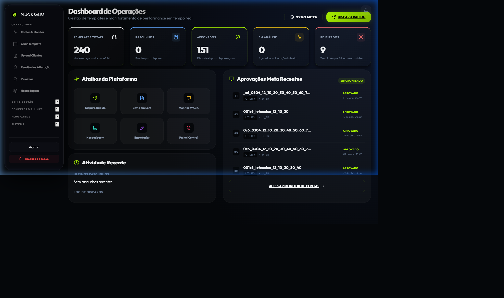

# Documentação Plug & Sales - Central de Ajuda

Bem-vindo à documentação oficial do **Plug & Sales**. Este guia foi projetado para fornecer um passo a passo detalhado de todas as funcionalidades da plataforma, facilitando o treinamento de novos funcionários e a apresentação para parceiros.

## 🚀 Guia de Início Rápido

O Plug & Sales é uma solução completa para gestão de disparos de WhatsApp, CRM de leads e automação de vendas. Abaixo você encontrará os links para cada módulo específico.

### 🛠️ Módulo Operacional
A espinha dorsal das operações de disparo.
- [Contas & Monitor](operacional/contas-monitor.md): Gerencie suas API Keys e sincronize templates.
- [Criar Template](operacional/criar-template.md): O coração da ferramenta para criar mensagens individuais ou em massa.
- [Gestão de Submissões](operacional/upload-clientes.md): Monitore pedidos de clientes e acompanhe o progresso dos disparos.

### 📈 Módulo CRM & Gestão
Onde os leads são transformados em vendas.
- [Funil de Vendas](crm/funil.md): Pipeline visual estilo Kanban para gestão de leads.
- [Gestão Consultiva](crm/gestao-consultiva.md): Acompanhamento detalhado e relatórios de métricas.

### 🔗 Conversão & Links
Ferramentas auxiliares para aumentar a conversão.
- [Encurtador de Links](paginas/encurtador.md): Reduza links e monitore cliques.
- [Rotacionador PRO](paginas/rotacionador.md): Distribua leads entre diferentes números de WhatsApp.

### 💳 Plug Cards
- [Marketplace & Wallet](cards/marketplace.md): Gerencie seus créditos e cartões.

---
> [!TIP]
> Esta documentação foi preparada para ser consumida pelo **NotebookLM**. Você pode carregar esses arquivos na ferramenta para ter um assistente inteligente que responde dúvidas sobre o sistema em tempo real.

