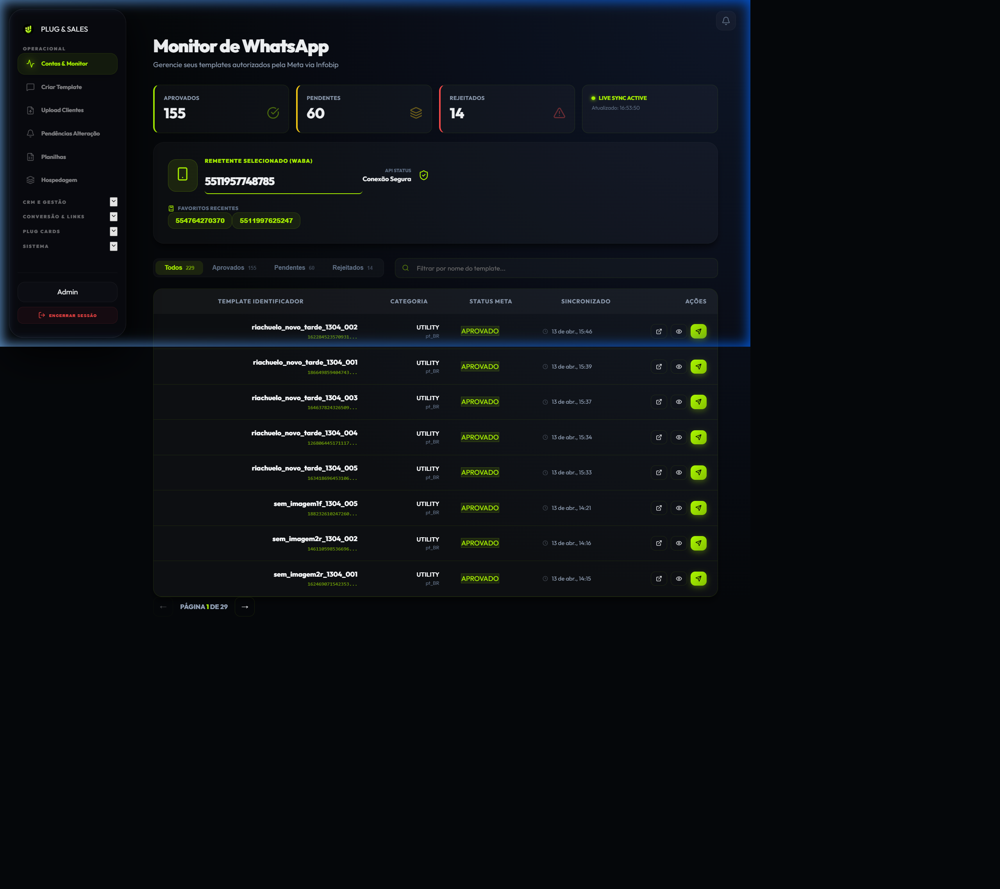

# Monitor de WhatsApp (Contas & Monitor)

O **Monitor de WhatsApp** é o ponto de partida para qualquer operação no Plug & Sales. Nesta página, você configura a conexão com a Meta (através da Infobip) e monitora o status de aprovação dos seus templates.

## 📌 Principais Funcionalidades

### 1. Configuração de Conexão
Para que o sistema consiga enviar mensagens e ler seus templates, você precisa configurar os dados da sua conta Infobip:
- **API Key**: Chave de autenticação fornecida pelo portal Infobip.
- **Remetente Selecionado (WABA)**: O número oficial do WhatsApp que enviará as mensagens.

### 2. Sincronização em Tempo Real
O sistema possui o **LIVE SYNC ACTIVE**, que sincroniza automaticamente com a Meta Cloud a cada 45 segundos ou sempre que você altera o número do remetente.

### 3. Gerenciamento de Templates
A tabela central exibe todos os templates vinculados ao número selecionado, com os seguintes dados:
- **Identificador**: O nome técnico do template.
- **Categoria**: Marketing ou Utilidade (Utility).
- **Status Meta**:
  - `APROVADO`: Pronto para uso.
  - `PENDENTE`: Em análise pela Meta.
  - `REJEITADO`: Meta negou o template (o motivo da rejeição será exibido logo abaixo do badge).

## 🚀 Passo a Passo: Como Sincronizar Novos Templates

1. Acesso a aba **Contas & Monitor** no sidebar.
2. No campo **Remetente Selecionado**, insira o número do WhatsApp (ex: `5511999999999`).
3. O sistema carregará automaticamente a lista de templates abaixo.
4. Se o template aparecer como **APROVADO**, você já pode clicar no ícone de avião (Send) para ir para a tela de disparo ou usá-lo no **Template Creator**.

## 💡 Dicas de Especialista
- **Favoritos Recentes**: O sistema lembra dos últimos 5 números usados para facilitar a troca rápida entre contas.
- **Ver Estrutura**: Clique no ícone de "olho" para ver exatamente como a mensagem está estruturada (JSON) antes de enviar.
- **Links Externos**: O ícone de link externo leva você direto para o portal da Infobip caso precise de ajustes manuais profundos.
