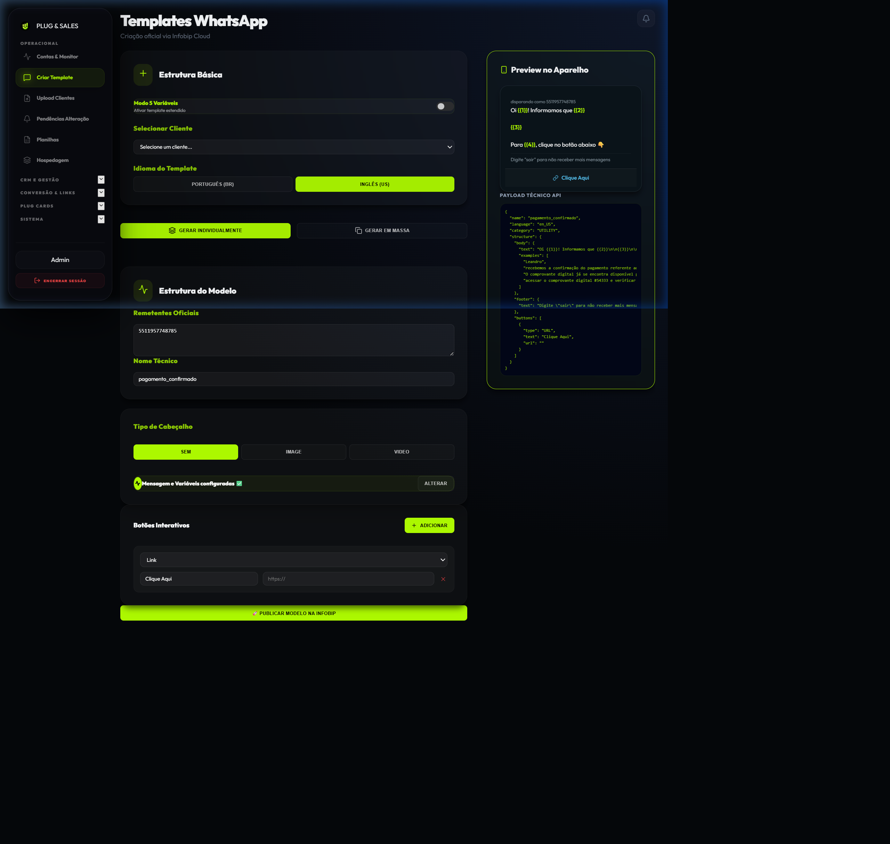
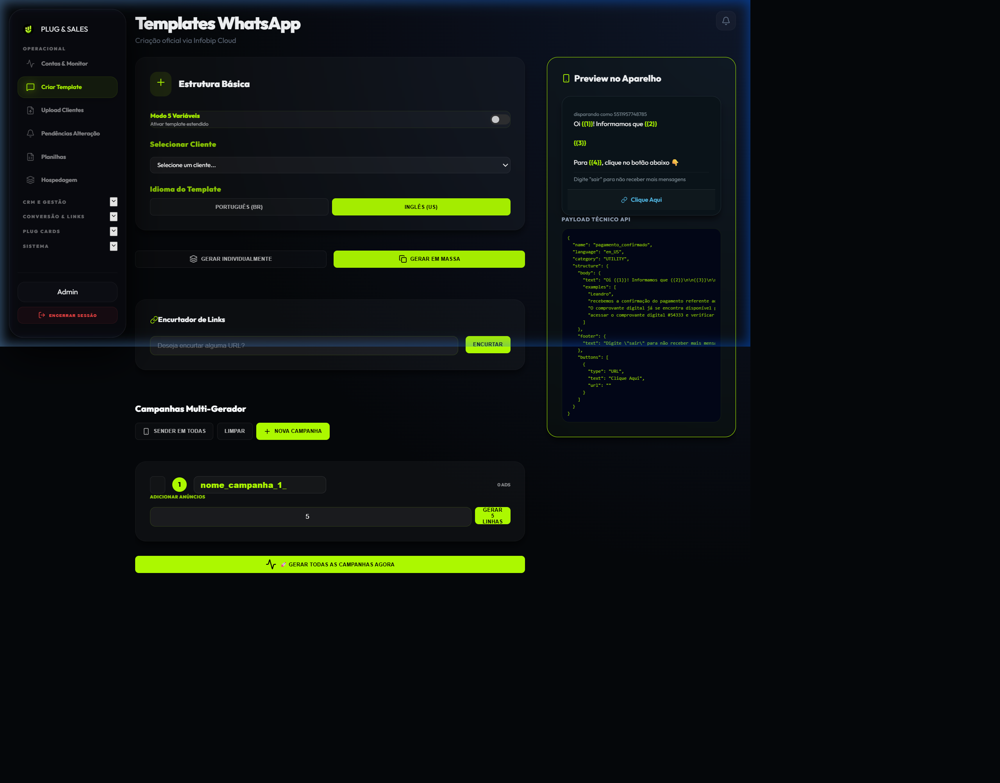

# Criador de Templates (Single & Bulk)

Esta é a ferramenta mais poderosa do Plug & Sales. Ela permite criar templates personalizados que seguem o **Padrão Leandro (Leandro Standard)**, garantindo que suas mensagens sejam aprovadas pela Meta com máxima eficiência.

## 📌 Modos de Criação

### 1. Geração Individual (MODEL)
Ideal para criar o primeiro template de uma campanha ou um modelo fixo para um cliente.
- **Configuração de Cabeçalho**: Escolha entre Texto, Imagem ou Vídeo.
- **Botões Dinâmicos**: Adicione até 3 botões (URL ou Resposta Rápida).
- **Variáveis**: O sistema usa um padrão de variáveis ({{1}}, {{2}}, etc.) que é injetado automaticamente para evitar bloqueios.

### 2. Geração em Massa (BULK)
O diferencial estratégico do Plug & Sales. Permite criar centenas de variações de templates (Testes A/B) com apenas alguns cliques.

#### Como usar o Bulk:
1. Defina um **Prefixo da Campanha** (ex: `venda_relogio_`).
2. Digite a quantidade de variações.
3. O sistema gerará linhas automáticas (ex: `venda_relogio_001`, `venda_relogio_002`).
4. **Gerar em Massa**: O sistema fará as chamadas de API sequencialmente, criando os templates na Infobip e vinculando-os ao CRM.

## 🚀 Passo a Passo: Criando seu Primeiro Template

1. **Escolha o Cliente**: Vincule a criação a um cliente já cadastrado no CRM.
2. **Configure o Visual**:
   - Se usar Imagem/Vídeo, faça o upload ou insira a URL.
   - Escreva o texto do corpo da mensagem.
3. **Defina os Botões**:
   - Use o **Encurtador Utilitário** integrado se precisar de links rastreáveis.
4. **Publicação**: Clique em **Publicar na Infobip**.
   - O sistema iniciará o processo de envio para a Meta.
   - O monitoramento começará automaticamente.

## ⚙️ Padrão Leandro (Standard Enforcement)
Para garantir aprovação, o sistema força (por padrão) uma estrutura de variáveis que a Meta costuma aprovar mais rápido. Mesmo que você mude o texto no preview, o payload enviado à API segue a regra de ouro do sistema para evitar rejeições.

## 💡 Dicas de Especialista
- **Variações de Suffix**: No modo Bulk, use suffixos diferentes para testar qual imagem ou qual CTA (chamada para ação) converte mais.
- **Webhook Push**: Assim que você cria um template, o sistema notifica o seu canal de suporte (n8n) automaticamente para que a equipe saiba que uma nova campanha está em pré-aprovação.
