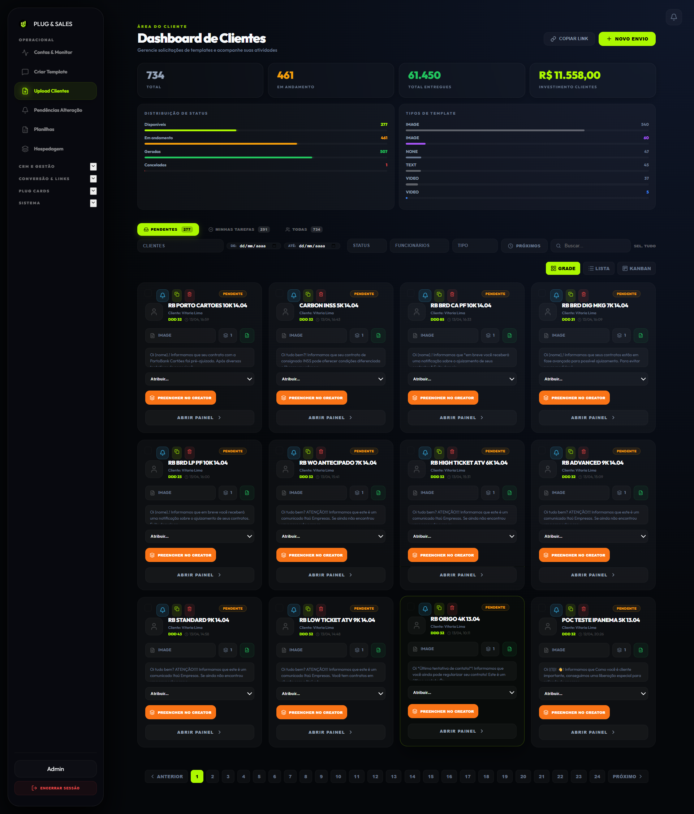

# Gestão de Submissões (Upload Clientes)

A aba **Upload Clientes** (ou Dashboard de Submissões) é onde os gestores e funcionários acompanham as solicitações de disparos feitas pelos clientes ou geradas pelo Template Creator.

## 📌 Modos de Visualização

O sistema oferece três formas de visualizar os cards de submissão:
1.  **Grade (Grid)**: Ideal para ver miniaturas de imagens e detalhes rápidos de cada campanha.
2.  **Lista (List)**: Melhor para uma gestão rápida de muitos pedidos, focando em nomes e datas.
3.  **Kanban**: Permite visualizar o fluxo de trabalho por status (Pendente, Em Mão, Gerado, Concluído).

## 🚀 Ciclo de Vida de uma Submissão

1.  **PENDENTE**: O cliente enviou os dados (copy, links, imagens) mas ninguém começou a trabalhar neles ainda.
2.  **EM MÃOS (Atribuído)**: Um funcionário "pegou" o card para trabalhar. O nome do responsável aparecerá no topo do card.
3.  **GERADO**: Os templates já foram criados no **Template Creator** e estão aguardando aprovação da Meta ou agendamento.
4.  **CONCLUÍDO**: O disparo foi realizado com sucesso.

## 🛠️ Funções Essenciais

### Preencher no Creator
Este é um dos recursos mais automatizados do sistema. Ao clicar em **Preencher no Creator**, o sistema abre a ferramenta de criação de templates já preenchida com a copy, o cliente e os links que estavam no card de submissão. Isso economiza minutos de trabalho manual e evita erros de digitação.

### Ações em Massa
Você pode selecionar vários cards (usando o checkbox no canto superior esquerdo de cada card) para:
- Alterar o status de todos.
- Atribuir todos a um único funcionário.
- Excluir em lote.

### Monitoramento de Métricas nos Cards
Em cards **CONCLUÍDOS**, você verá automaticamente:
- **Total Entregue**: Quantas mensagens foram enviadas.
- **Custo do Cliente**: O valor faturado para o cliente com base no preço por mensagem definido.

## 💡 Dicas de Especialista
- **Duplicar Campanha**: Use o ícone de cópia para duplicar um pedido de cliente, aproveitando a estrutura (como fotos e DDD) e limpando apenas os links antigos.
- **Pedir Alteração (Alerta)**: Se algo estiver errado no pedido do cliente, clique no ícone de **Sino** para gerar um alerta de alteração.
- **Dashboard Externo**: Lembre-se que o que você vê aqui é o "backoffice". O seu cliente tem um dashboard simplificado onde ele acompanha apenas o status e as métricas finais.
